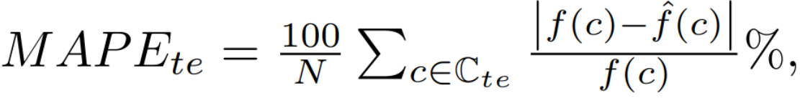

## Metric

For reporting the accuracy, we rely on the mean absolute percentage error (MAPE), an interpretable and comparable metric.

where f is a function that gives the actual performance value of a configuration while hat f is the learned function and prediction model. 

We choose the MAPE to depict our results since it is frequently used when the quantity to predict is known to remain above zero (as in our case). 

Furthermore, it has the merit of being easy to understand and compare (it is a percentage). 

It is also commonly used in approaches about learning and configurable systems. 

All reported accuracy values are made with this metric in order to have an easier comparison. 
