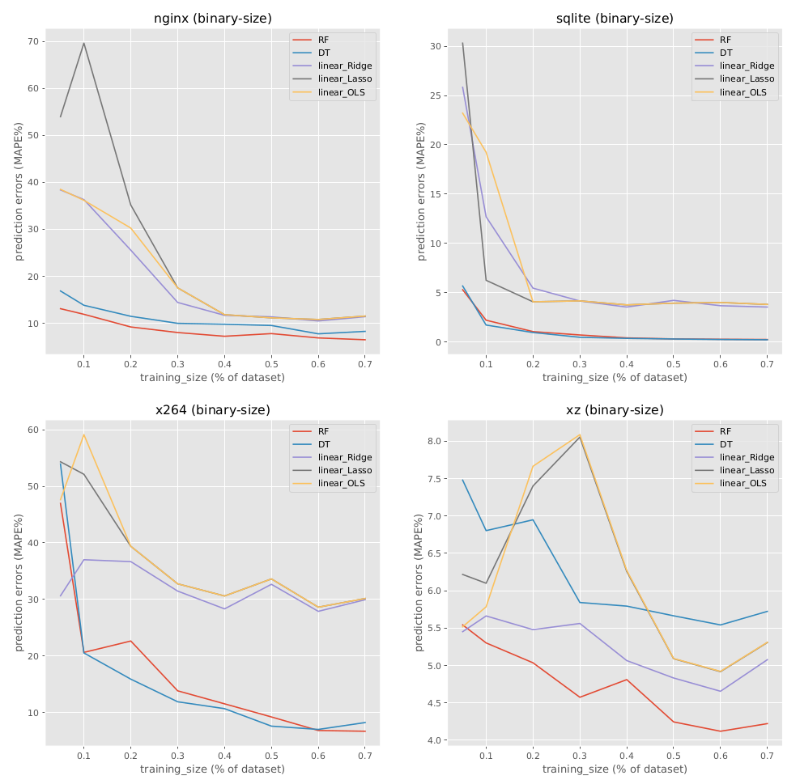
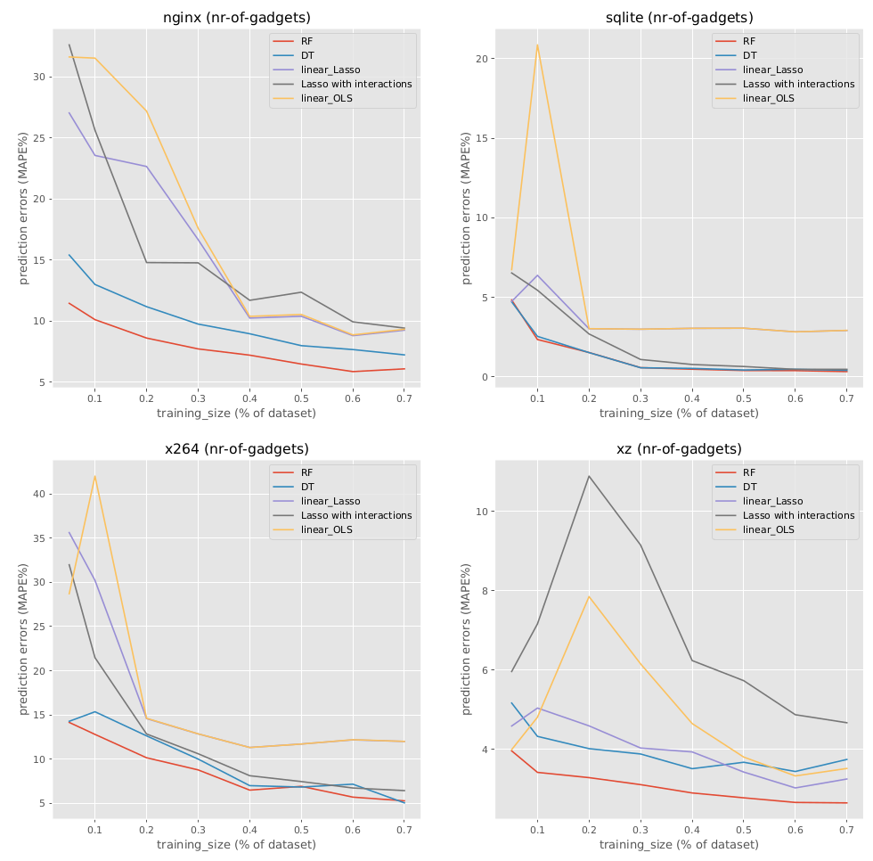

# Results

and

depict prediction errors (MAPE) w.r.t. training set size (as a percentage of the available measurements) for binary size and gadgets respectively. We report MAPE of the best learning techniques per system. We repeat the experiments 30 times and report on the average. Complete results with all learning, standard deviation, etc. can be found in the output directory. 

SQLite is the simplest configurable system to learn. 
RF and DT can quickly reach less than 1% error with $40$ compilations. Already with 10 compilations, the prediction error is around 5%. 
Though more unstable, linear regression models can also achieve less than 5%. 
Similar observations can be done for the prediction of gadgets w.r.t. accuracy. 
However, OLS should not be used for gadget, that is, Lasso is needed to mitigate the overfitting for gadget. 

The learning for xz can quickly reach high accuracy: around MAPE 6%  with 10 compilations. 
The increase of the training set does not improve significantly the accuracy. 
As with sqlite, OLS is too unstable. 
Ridge competes with DTs.

nginx is more challenging to learn. 
With 20 compilations in the training, OLS and Ridge get 40% prediction errors. 
RF is the best learning technique, but has 13% prediction errors for this budget. 
Hence, more measurements are needed. 
RF with 60 compilations can reach less than 10% errors. 
DTs is competing, but linear-based regression is not suited.

With 20% prediction errors for 80 compilations, x264 is the most costly system for learning binary size. 
Interestingly, learning gadgets is easier (10% prediction errors for the same training budget). 
RF and DT can progressively improve the accuracy: 10% for 200 measurements and size (5% prediction errors for gadgets). 
Tree-based learning methods are necessary to handle the complex interactions among options and linear-based methods are not suited for x264. 
